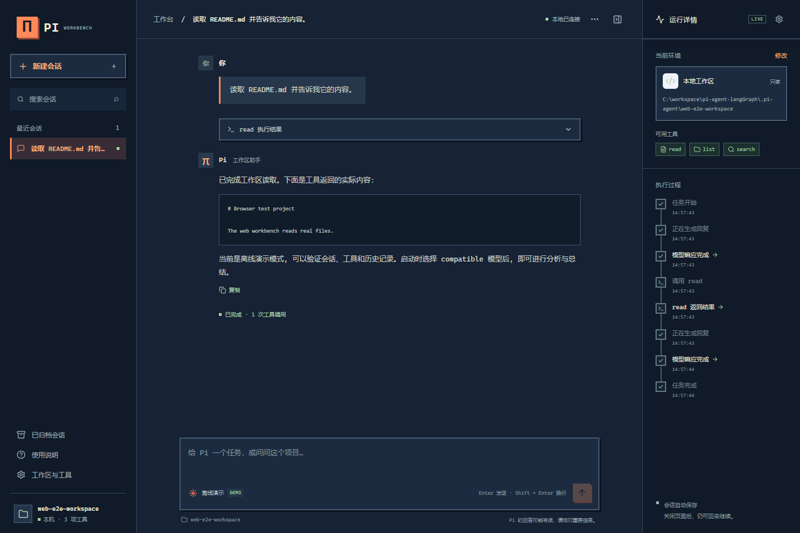
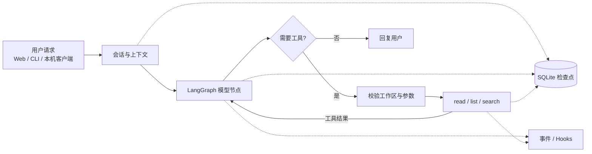

<div align="center">

# Pi Agent LangGraph

**用 Python + LangGraph 重构 Pi Agent 核心能力，把模型、工具、会话与可观测性串成可运行、可验证的 Agent。**


[](LICENSE)

[功能概览](#features) · [快速开始](#quickstart) · [使用方法](#usage) · [配置说明](#configuration) · [文档与求助](#help)

</div>

面向希望从“会调用模型”走向“能理解和构建完整 Agent”的 Python / AI 应用开发者。项目以 Pi 的核心设计为学习线索，提供可逐阶段验证的实现、命令行工具，以及可直接体验的中文本机工作台。

> **项目进度**：M0–M11 与本机 Web 扩展已按各自交付范围归档。Web 已支持流式、恢复/分支、服务管理、文件修改/命令执行及可配置审批，工具设置调整已纳入整体归档并复核 CLI/TCP 基线兼容性。新环境 Windows / Linux 与真实服务部署验证仍有后置项，详见 [当前计划](PLAN.md)、[整体复审归档](docs/acceptance/web-cli-review-2026-10-01.md)、[Web 初次归档](docs/acceptance/web-archive-2026-10-01.md) 和 [后续清单](docs/follow-ups/web.md)。

<a id="features"></a>

## ✨ 功能概览



*已有本机浏览器测试截图：离线演示模式读取合成工作区中的 README，展示真实工具结果。*

| 能力 | 可以做什么 | 使用入口 |
| :--- | :--- | :--- |
| 🖥️ 本机工作台 | 中文深色界面、Markdown/流式回复、会话标题搜索与归档、移动端布局 | Web UI |
| 🔁 模型与工具循环 | 连接 compatible 模型，调用 `read` / `list` / `search`，将结果交回模型 | Web / compatible CLI |
| 💾 持久化会话 | SQLite 保存消息与检查点；Web 支持历史分页、显式中断恢复与完成检查点分支 | Web / compatible CLI / 会话 API |
| 🧠 上下文管理 | 项目规则、模板、近似 token 预算、历史压缩与摘要 | 上下文管线 / `context inspect` |
| 🛡️ 工具与执行控制 | 工作区路径约束；Web 文件差异与命令提案经人工批准后执行；CLI 命令交互审批 | Web 审批 / `command` |
| ⚙️ 启动与服务管理 | Windows、macOS/Linux 启动；查询、停止、重启与锁/端口冲突诊断 | 启动脚本 / `pi-agent-web` |
| 🔎 过程与评测 | Web 累计/会话 Token 用量、默认展开节点快照、图事件、可选 telemetry、离线工具评测 | Web / CLI / eval |
| 🔌 本机客户端与服务端 | 共享令牌认证、创建会话、发送请求、取消与快照 | `pi-agent-server` / `pi-agent-client` |

一次“读取文件并总结”的请求如何流转（compatible 运行路径）：



默认 fake CLI 只运行最小图；Web fake 模式额外提供真实文件读取演示。当前 Web 为本机单用户服务，提供节点级进度、流式文本、显式中断恢复和 checkpoint 分支。`read/list/search/write/edit/command` 默认全部选中，页面可逐项取消，从下一轮对话生效。文件和命令默认需人工审批，可通过 `--no-require-approval` 改为直接执行；命令默认允许系统 shell，自定义 `--allow-executable` 会替换该列表。工作区路径限制不等于操作系统沙箱。

<a id="quickstart"></a>

## 🚀 快速开始

### 1. 准备环境

| 依赖 | 版本 / 要求 | 用途 |
| :--- | :--- | :--- |
| Python | `>=3.11,<3.14` | Agent 运行时 |
| uv | 本机已安装，`uv --version` 可用 | Python 依赖与命令管理 |
| Node.js / npm | Node.js `22.12+`，或符合 Vite 7 要求的版本 | 仅构建 Web 前端时需要 |
| Git | 可用 | 获取仓库 |

以下命令默认使用 **Windows / PowerShell**，Web 启动另提供 macOS / Linux 的 Bash 示例，均在项目根目录执行。依赖首次安装需要联网；fake 示例运行时不调用远程模型。

```powershell
git clone https://github.com/Jaysonxiao/pi-agent-langGraph.git
cd pi-agent-langGraph
```

### 2. 选择一个入口

| 想先体验什么 | 选择 |
| :--- | :--- |
| 图形界面、文件读取和持久化聊天 | **A · Web 工作台** |
| 最小 Agent 请求与事件输出 | **B · 离线 CLI** |

**A · 启动 Web 工作台**

```powershell
.\scripts\start-web.ps1
```

macOS / Linux：

```bash
./scripts/start-web.sh
```

脚本会安装 Python / 前端依赖、构建静态资源并启动服务。打开 [http://127.0.0.1:8766](http://127.0.0.1:8766)，输入：

```text
读取 README.md
```

**预期结果**：页面标识为“离线演示”；中间显示文件读取结果，右侧出现 `read` 执行记录。刷新页面仍可查看会话。此模式验证真实工具和持久化流程；模型分析与总结需要切换 compatible。

**B · 运行最小 CLI 示例**

```powershell
uv sync
uv run pi-agent --provider fake --prompt hello --events text
```

**预期输出**：

```text
[message] model/assistant: fake reply
[state_update] model: {"status":"completed","error":null}
```

这个最小示例无需 API Key，不创建持久化会话。接入真实模型见下方“使用方法”和“配置说明”。

<details>
<summary>手工安装、构建并启动 Web</summary>

```powershell
uv sync --extra web
Push-Location web-ui
npm ci
npm run build
Pop-Location
uv run --extra web pi-agent-web --provider fake --workspace .
```

前端构建产物不纳入 Git，新 checkout 需要先构建。构建后无需 Node.js 常驻服务；开发模式与前端测试见 [Web UI 文档](docs/web-ui.md)。

</details>

<a id="usage"></a>

## 🧭 使用方法

### Web：聊天、读取文件与查看执行过程

1. 新建会话，输入请求；例如 `列出当前目录的文件` 或 `读取 README.md`。
2. 在右侧查看模型与工具阶段，点击已完成节点查看输入、输出和检查点投影。
3. 使用“工作区与工具”切换本地工作区，启停工具并调整单轮调用上限。
4. 需要中断时点击“停止运行”；历史会话可重命名、归档和恢复。
5. 未完成的运行可点击“继续运行”，从当前检查点继续；可能重新请求模型或读取文件，不会重复追加用户消息，也不会在服务重启后自动执行。
6. 会话操作菜单中的“从检查点创建分支”可选择已完成的检查点，复制为独立会话并继续聊天；原会话保留。

支持 streaming 的模型会逐步展示文本；完成后保存完整回复。fake 模式使用确定性分片演示界面，compatible 使用服务端原生 SSE。非流式模型仍显示完整回复；CLI/TCP 的输出方式不因此改变。

已创建会话固定使用创建时的工作区。按下方配置好 `.env` 后，可启动真实模型：

```powershell
.\scripts\start-web.ps1 -Provider compatible

# 可选：指定工作区和端口；目录需要已存在。
.\scripts\start-web.ps1 -Provider compatible -Workspace .\safe-workspace -Port 8766
```

macOS / Linux：

```bash
./scripts/start-web.sh --provider compatible

# 可选：指定工作区、数据库和端口；工作区需要已存在，数据库必须在工作区之外。
./scripts/start-web.sh --provider compatible --workspace ./safe-workspace \
  --database "$HOME/.pi-agent/web.sqlite" --port 8767
```

运行 `./scripts/start-web.sh --help` 查看参数。两个启动脚本都以项目根目录解析相对路径。

服务管理与人工审批：

```bash
./scripts/start-web.sh status
./scripts/start-web.sh stop
./scripts/start-web.sh restart --provider compatible --workspace ./safe-workspace

# 默认开启全部工具，write/edit/command 默认需要页面审批。
./scripts/start-web.sh --provider compatible --workspace ./safe-workspace

# 可选：不等待人工审批，直接执行当前勾选的工具。
./scripts/start-web.sh --provider compatible --no-require-approval

# 可选：以 git 替换默认系统 shell 的可执行程序允许列表。
./scripts/start-web.sh --provider compatible --allow-executable /usr/bin/git
```

Windows 对应参数为 `-Action status|stop|restart`、`-RequireApproval $false`、`-AllowExecutable`。macOS/Linux 默认 shell 为 `/bin/sh`，Windows 为系统 `cmd.exe`。保留 `--enable-file-mutations` / `-EnableFileMutations` 兼容旧命令；服务端禁用可使用 `--no-enable-file-mutations` / `-EnableFileMutations:$false` 和 `--disable-command` / `-DisableCommand`。
管理自定义数据库时重复指定 `--database` / `-Database`；重启时提供所需启动参数。
`status` / `stop` 复用已安装的 Python 环境，不构建前端。旧版服务没有实例记录时，请在原终端 `fg` 后 `Ctrl+C` 退出，再用新入口启动；`Ctrl+Z` 会暂停进程并继续占锁。审批和故障恢复的完整边界见 [Web UI](docs/web-ui.md)。

### CLI：读取文件并保存会话

先按“配置说明”创建 `.env`。下面使用合成文件，准备一个独立工作区：

```powershell
New-Item -ItemType Directory -Force .\safe-workspace
Set-Content -LiteralPath .\safe-workspace\probe.txt -Encoding utf8 -Value "Marker: PI-DEMO-001. This is a local test file."

uv run --env-file .env pi-agent --provider compatible `
  --workspace .\safe-workspace `
  --database .\sessions.sqlite `
  --session-id demo `
  --prompt "Read probe.txt and summarize it" `
  --events jsonl
```

**预期结果**：模型请求读取 `probe.txt`，CLI 输出工具与模型事件，回复基于文件内容，消息与检查点写入 `sessions.sqlite`。实际工具选择和回答由配置的模型决定。

继续使用相同数据库和会话 ID，可以追加一轮对话：

```powershell
uv run --env-file .env pi-agent --provider compatible --workspace .\safe-workspace --database .\sessions.sqlite --session-id demo --prompt "What marker did you just read?" --events text
uv run pi-agent session list --database .\sessions.sqlite
```

第二条命令每行输出一条会话 JSON，包含 `session_id`、`created_at`、`updated_at`。

| 常用参数 | 含义 / 示例 |
| :--- | :--- |
| `--provider` | `fake` 为默认最小演示；`compatible` 显式启用真实模型路径 |
| `--workspace` | 工具允许访问的已有目录，如 `.\safe-workspace` |
| `--database` / `--session-id` | compatible CLI 必填；数据库父目录必须已存在 |
| `--events` | `text` 便于阅读；`jsonl` 便于程序处理 |
| `--model` / `--base-url` | 覆盖对应的环境配置 |
| `--trace-file` | 可选事件 / 用量元数据文件，如 `trace.jsonl` |
| `--telemetry-file` | 可选生命周期 spans、指标与结构化日志，如 `telemetry.jsonl` |
| `--allow-executable` | 可重复指定允许提案的程序；执行仍需独立交互审批 |

`--trace-file` 与 `--telemetry-file` 用于 compatible CLI，路径受工作区策略约束；例如 `telemetry.jsonl` 写入 `safe-workspace/telemetry.jsonl`，不包含 prompt 或消息正文。SQLite 会话会保存对话，发送给模型的文件内容应在你的授权范围内。更多参数使用 `uv run pi-agent --help` 查看。

<details>
<summary>上下文检查与离线工具评测</summary>

```powershell
# 检查指令来源、消息角色、大小估算和压缩统计，不调用模型、不打印提示词正文。
uv run pi-agent context inspect --provider fake --workspace . --active-path src/pi_agent --max-tokens 4096

# 在临时工作区运行真实 list/read 工具，并检查实际工具调用。
uv run pi-agent eval --suite tools --provider fake
```

工具评测预期返回 JSON 报告，包含 `"passed":1`、`"total":1`。token 统计为近似估算；该评测验证离线工具链路，真实模型质量另行评估。

</details>

<details>
<summary>命令提案与人工审批（CLI）</summary>

compatible 请求加入 `--allow-executable` 后，模型可以提出允许列表内的命令。获得提案 ID 后，在交互终端审阅并选择批准或拒绝；将 `PROPOSAL_ID` 替换为实际值，允许程序必须与提案一致：

```powershell
uv run pi-agent command show PROPOSAL_ID --database .\sessions.sqlite
uv run pi-agent command approve PROPOSAL_ID --database .\sessions.sqlite --workspace .\safe-workspace --allow-executable python
# 或拒绝该提案：
uv run pi-agent command reject PROPOSAL_ID --database .\sessions.sqlite
```

`approve` 展示准确 argv，并要求手工输入确认文本。已消费的提案不会在崩溃后自动重放。详见 [M8 接线与边界](docs/acceptance/M8-closure.md)。

</details>

<details>
<summary>本机服务端与客户端</summary>

先准备上述 `safe-workspace`。在服务端终端设置共享令牌并启动服务，将示例令牌替换为自行生成的长随机值：

```powershell
$env:PI_AGENT_REMOTE_TOKEN = "replace-with-a-long-random-local-token"
uv run pi-agent-server --provider fake --workspace .\safe-workspace --database .\remote-sessions.sqlite --port 8765
```

另开终端，进入项目根目录并设置相同令牌，然后创建会话；将后续命令中的 `SESSION_ID` 替换为返回的 ID：

```powershell
$env:PI_AGENT_REMOTE_TOKEN = "replace-with-a-long-random-local-token"
uv run pi-agent-client --port 8765 create
uv run pi-agent-client --port 8765 prompt --session-id SESSION_ID --text "hello"
uv run pi-agent-client --port 8765 snapshot --session-id SESSION_ID
```

每个客户端命令输出一份 JSON 快照。fake 服务端用于确定性演示；真实模型需要在服务端显式加载 `.env` 并选择 `--provider compatible`。服务端持有工作区、模型和数据库，客户端只发送会话命令。两端仅连接 `127.0.0.1`，不提供公网部署保障；令牌仅从环境变量读取。见 [M10 设计](docs/design/M10.md)。

</details>

<a id="configuration"></a>

## ⚙️ 配置说明

### 模型配置

创建本地配置文件（仅首次执行，避免覆盖已有配置）：

```powershell
Copy-Item .env.example .env
```

`.env.example` 只记录变量说明。在 `.env` 中填入实际配置，以下仅为占位示例：

```dotenv
PI_AGENT_PROVIDER=compatible
PI_AGENT_MODEL=your-model-id
PI_AGENT_BASE_URL=https://provider.example/v1
PI_AGENT_API_KEY=replace-with-your-api-key
```

| 环境变量 | 默认值 | 说明 |
| :--- | :--- | :--- |
| `PI_AGENT_PROVIDER` | `fake` | 模型配置解析器的默认 provider；CLI 运行真实模型仍需显式传 `--provider compatible` |
| `PI_AGENT_MODEL` | 无 | compatible 必填，服务商支持的模型 ID |
| `PI_AGENT_BASE_URL` | 无 | compatible 必填，API 根地址；客户端追加 `/chat/completions` |
| `PI_AGENT_API_KEY` | 无 | compatible 使用的密钥，只保存在本地环境中 |
| `PI_AGENT_API_KEY_ENV` | `PI_AGENT_API_KEY` | 自定义密钥变量名称 |
| `PI_AGENT_TIMEOUT_SECONDS` | `30` | 单次请求时限，正数秒 |
| `PI_AGENT_MAX_ATTEMPTS` | `3` | 最大尝试次数，含首次请求 |
| `PI_AGENT_RUN_TIMEOUT_SECONDS` | `120` | 整轮运行时限，正数秒 |
| `PI_AGENT_REMOTE_TOKEN` | 无 | 本机 TCP 服务端 / 客户端必填共享令牌 |
| `PI_AGENT_LIVE` | 未启用 | 仅在显式执行真实服务测试时设为 `1` |

**加载规则**：普通命令通过 `uv run --env-file .env ...` 显式加载；`start-web.ps1 -Provider compatible` 或 `start-web.sh --provider compatible` 自动读取项目根目录 `.env`。文件存在本身不会让默认 fake CLI 访问模型。`.env` 已被 Git 忽略，请勿提交密钥；`PI_AGENT_BASE_URL` 不要再附加 `/chat/completions`。

### 工作区、数据与项目规则

| 配置项 | 位置 / 行为 |
| :--- | :--- |
| Web 数据库 | 默认 `~/.pi-agent/web.sqlite`；可用 PowerShell 脚本 `-Database`、Bash 脚本或 Web CLI `--database` 指定，必须在工作区之外 |
| CLI 数据库 | 通过 `--database` 指定；同一数据库 + 会话 ID 用于后续对话 |
| Web 工作区 | 启动时 PowerShell 脚本 `-Workspace`、Bash 脚本或 Web CLI `--workspace` 指定，页面设置可更换；已有会话保留原工作区 |
| Web 项目指令 | 工作区中的 `PI-AGENTS.md`，见 [格式与发现规则](docs/pi-agents.md) |
| CLI / TCP 项目指令 | 沿用 `AGENTS.md` 上下文管线；与 Web 的规则文件区分 |

不要让独立 CLI / TCP 进程与 Web 同时驱动同一数据库。`.env`、`.git`、私钥和运行缓存等敏感路径会被 provider 可见的只读工具排除。

<a id="help"></a>

## 📚 文档与求助入口

### 从运行到理解实现

| 想了解什么 | 阅读入口 |
| :--- | :--- |
| 项目定位、代码地图与学习方式 | [AGENTS.md](AGENTS.md) |
| 当前进度、里程碑与未关闭事项 | [PLAN](PLAN.md) |
| 全部文档与阶段索引 | [文档导航](docs/README.md) |
| Web 开发、启动、测试和运行边界 | [Web UI](docs/web-ui.md) |
| 项目指令如何影响工作台 | [PI-AGENTS.md 规范](docs/pi-agents.md) |
| 学习过程与设计决策 | [学习日志](LEARNING_LOG.md) |
| 完整请求链路与架构复盘 | [M11 设计](docs/design/M11.md) · [M11 架构](docs/architecture/M11.md) |
| 验收结果与真实模型记录 | [M11 验收](docs/acceptance/M11.md) · [真实模型手工验证](docs/acceptance/M11-real-provider-manual.md) |
| 后置环境与部署验证 | [后置验证记录](docs/history/2026-09-28-m11-deferred-deployment-validation.md) |

学习时先看完整链路，再跟踪一个“读取文件”的请求，最后结合源码与验收记录理解各模块的协作。`docs/history/` 用于追溯历史，当前状态以 `PLAN.md` 为准。

### 常见问题

<details>
<summary>没有 API Key，可以体验吗？</summary>

可以。默认 Web 是离线演示，可调用真实 `read` / `list` 工具；默认 CLI 返回确定性的 `fake reply`。真实模型分析需要配置 compatible。

</details>

<details>
<summary>为什么读不到 probe.txt，或者找不到 telemetry.jsonl？</summary>

先创建 `--workspace` 指向的目录，并把 `probe.txt` 放在其中。工具路径相对于工作区解析；`--telemetry-file telemetry.jsonl` 也写在工作区内。参考上方完整 CLI 示例。

</details>

<details>
<summary>为什么 Web 页面没有加载，或端口被占用？</summary>

新 checkout 没有前端构建产物，先运行 `start-web.ps1`（Windows）或 `start-web.sh`（macOS / Linux），或按手工步骤执行 `npm ci` 与 `npm run build`。端口占用时使用 `-Port 8767`（PowerShell）或 `--port 8767`（Bash），然后访问对应本机地址。构建失败时先检查 Python、Node.js 和 uv 版本。

</details>

<details>
<summary>能自动修改文件、执行命令或部署到公网吗？</summary>

当前 Web 默认开启文件修改和命令工具，默认人工审批；启动时可用 `--no-require-approval` 关闭审批。所有工具可取消勾选，并分别设置每次用户请求的最大调用次数（0–20，新设置默认各 20），从下一轮生效；审批继续和恢复沿用原额度，旧设置保留已保存的数值。侧栏会话按工作区分组。当前说明见 [Web 使用文档](docs/web-ui.md)。CLI 的命令执行仍需要允许列表、持久化提案与人工批准。结果不确定的操作不自动重放。本机 Web / TCP 服务不提供多用户身份、TLS 或公网部署能力；当前参数与验证见 [工具设置调整记录](docs/acceptance/web-tool-settings-2026-10-01.md)。

</details>

### 开发与验证

```powershell
uv sync --all-extras
uv run pytest -q --basetemp=.pytest-tmp
uv run mypy src tests
uv run ruff check .
uv run ruff format --check .
```

默认测试离线运行；Web 前端与浏览器测试命令见 [Web UI 文档](docs/web-ui.md)。

<details>
<summary>可选：真实 Provider smoke（会访问已配置的模型服务）</summary>

```powershell
$env:PI_AGENT_LIVE = "1"
uv run --env-file .env pytest tests/live/test_provider_smoke.py -m live -q --basetemp=.pytest-tmp-m8-live
Remove-Item Env:PI_AGENT_LIVE
```

覆盖普通回复、原生流、SQLite 重开 / 续聊以及摘要压缩路径。通过仅说明所配置服务的基本协议集成可用，不代表所有 compatible 服务或摘要质量均已验证。

</details>

遇到问题请先查看上方常见问题与对应文档，再到 [GitHub Issues](https://github.com/Jaysonxiao/pi-agent-langGraph/issues) 检索或 [提交问题](https://github.com/Jaysonxiao/pi-agent-langGraph/issues/new)。建议附上系统和运行时版本、执行命令、预期结果与脱敏错误信息；不要提交 `.env`、API Key 或私有文件正文。

## 开源协议

本项目采用 [MIT License](LICENSE)。项目设计参考 [Pi Agent](https://github.com/earendil-works/pi)；上游项目另有自己的 [MIT 协议与版权声明](https://github.com/earendil-works/pi/blob/main/LICENSE)。
