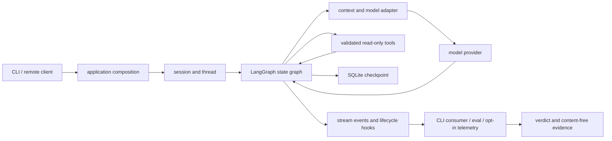

# M11 架构复盘、威胁模型与检查清单

本页记录 M11 收束后的系统边界。阶段状态和门禁唯一来源仍是 [PLAN](../../PLAN.md)，实际运行证据见 [M11 验收记录](../acceptance/M11.md)。本次复盘不扩展工具权限、模型供应商或网络部署范围。

## 从请求回到整体

`probe.txt` 的贯穿路径是：入口验证 workspace 和 provider 配置；session runtime 恢复 thread/checkpoint；图组装上下文并请求模型；fake 模型提出 list/read；受限工具验证路径并返回 ToolMessage；图把结果交还模型并产出最终回复；stream 记录成功的工具 after-hook 和 run_end；tools eval 独立核对调用轨迹与答案；显式 telemetry 开关才将去内容的 lifecycle 记录写入工作区 JSONL。

失败路径也属于这条链：非法 workspace 在创建 provider client 前拒绝；工具参数或路径不合法时工具返回受控错误；模型/provider 故障进入 run error；调用取消应结束 async stream 并关闭 client；checkpoint 持久化用于 thread 恢复，但不充当进程间锁或外部副作用事务。

## Pi 源码映射与 Python 取舍

Pi 固定版本的关键因果链位于 `packages/agent/src/agent-loop.ts`：`runLoop()` 管理轮次，`streamAssistantResponse()` 处理模型流，`executeToolCalls()` 执行工具，之后产生工具执行结束事件并将结果加入下一轮输入。这个结构解释了为何工具调用消息本身不能当作“工具确实运行成功”的证据。

Python 重写将循环拆成可观察的 LangGraph 节点和条件边；模型适配、工具验证、应用级 hooks 与 checkpoint 保持独立边界。M11.1 从成功 `after_tool` 事件投影轨迹，并用 thread/run/call identity 过滤重复通知；它不抑制重复执行。M11.2 在公开 compatible CLI 上用显式开关接入 lifecycle hook 和 JSONL ports。M11.3 的 fake 场景只测本机 loopback 和真实只读工具，不将模型质量或公网可达性包装成已验收能力。

LangGraph checkpointer 管理图状态的持久化/恢复；它不自动管理应用连接、任务所有权、用户授权或外部系统事务。应用层负责这些职责。可参照 [LangGraph persistence 文档](https://docs.langchain.com/oss/python/langgraph/persistence)理解 thread/checkpoint 的边界。

## 模块职责

| 模块 | 职责 | M11 证据 |
|---|---|---|
| `src/pi_agent/cli/app.py`、`cli/runtime.py` | 参数、信任边界、应用组合及公开运行入口 | 默认 fake 路径；compatible provider opt-in telemetry 测试 |
| `src/pi_agent/graph/`、`models/` | 状态图、循环路由、模型边界 | 现有 graph/provider 回归与 tools eval |
| `src/pi_agent/tools/`、`security/` | 参数验证、workspace 限制、只读工具执行 | 贯穿场景实际 list/read |
| `src/pi_agent/sessions/` | SQLite checkpoint 与 session 生命周期 | 全仓回归、M10 进程/重启验收 |
| `src/pi_agent/extensions/hooks.py`、`telemetry/` | 生命周期扩展点和 opt-in telemetry ports | M11.2 CLI/sink 测试；同步本地 JSONL sink |
| `src/pi_agent/evals/`、`cli/eval_tools.py` | 观察、独立预期与安全报告 | tools suite 1/1 和 11 个 eval tests |
| `tests/`、`scripts/m11_performance_baseline.py` | 行为证据、资源管理与本机性能样本 | 全量计划门禁及可复现 loopback 脚本 |

## 威胁模型

| 资产 / 边界 | 威胁 | 已有控制与测试 | 仍需控制 / owner / 完成标准 |
|---|---|---|---|
| provider credential | CLI/telemetry/log 泄露密钥 | 环境变量读取；M11.2 日志脱敏与公开入口断言 | **维护者**：审计新增日志路径；完成标准为任何 telemetry/eval 产物均无凭据字面值 |
| 本地 workspace 文件 | 路径穿越、越界读取、符号链接逃逸 | workspace policy、工具参数校验及安全测试 | **工具维护者**：平台升级后重跑路径/链接测试；完成标准为所有文件工具都经同一 policy |
| CLI 请求与内容 | prompt、工具结果意外持久化 | telemetry 只记录生命周期标识和低基数标签；eval 报告不带内容 | **可观测性维护者**：每个新增字段做内容审查；完成标准为字段 allowlist 测试覆盖新增 ports |
| SQLite checkpoint | 数据损坏、恢复错误、资源未关闭 | transaction/checkpoint tests；M11.3 复测关闭告警 | **session 维护者**：覆盖崩溃/重启与关闭；完成标准为资源 warning 复测清零且恢复测试通过 |
| async run / provider client | 取消后任务或连接泄漏 | provider lifecycle `finally` close、M10 cancellation tests | **runtime 维护者**：重复取消与超时压力测试；完成标准为所有 task/client 可观察地终止 |
| telemetry JSONL | 磁盘满、权限失败、并发追加交错 | 默认关闭；workspace 路径校验；hook 异常隔离 | **telemetry 维护者**：按使用规模决定轮转/队列/原子写；完成标准需定义吞吐、故障告警与多进程契约 |
| command execution / external effects | 未授权命令或重复副作用 | 命令能力采用独立 proposal/approval 边界；默认图是只读 | **产品/安全 owner**：任何启用前定义授权、审计、幂等或补偿，并完成专门威胁审查 |
| remote protocol | 未授权访问、会话错配、网络暴露 | M10 有认证 framing 和本机 loopback 验收 | **部署 owner**：外部部署前定义 TLS、身份、限流、租户隔离并通过部署环境验收 |

## 生产差距与下一步

- M11 fake/eval 证明确定性应用组合和工具观察契约；不证明真实模型工具选择质量、服务商可用性或外网行为。若要评价模型质量，需要固定数据集、评分准则和人工复核基准。
- JSONL adapter 是小型同步本地实现；高吞吐、轮转、跨进程原子追加、持久化重试和真实 collector 互通需在确定部署目标后单独设计并压测。
- 单进程 checkpoint 恢复不等同于多进程 lease、exactly-once 工具执行或外部事务一致性。含副作用工具上线前必须另行设计幂等键、审批、重试与补偿。
- CI matrix 配置不代表远端 job 已运行。新环境 Windows/Linux 证据必须引用成功的实际 runner；本机 Windows 结果不能替代 Windows CI job。
- ResourceWarning 的成因应按 traceback 中 connection 创建点修复；不应以过滤 warning 或最后执行的测试名称代替根因分析。

## 陌生 Agent 源码分析清单

1. 固定仓库、版本/commit 与运行入口；区分源码事实、文档声明和本地实测。
2. 从一个具体用户请求追踪入口、状态初始化、上下文变换、模型请求、工具 dispatch、结果回灌和最终输出。
3. 找到循环终止条件、错误/取消路径、重试与 iteration limit，并指出控制权在哪一层。
4. 跟踪 thread/session/checkpoint 的 key、创建/加载/保存/清理责任及其跨进程假设。
5. 追踪工具权限：参数 schema、路径/命令策略、审批点、执行边界、结果脱敏和日志路径。
6. 区分模型请求/响应、图状态、事件流、hooks、metrics/traces 的数据来源与敏感字段。
7. 为每条重要调用链找对应测试；标注 fake/mock 证明了什么、没有证明什么。
8. 记录失败路径、资源所有权、并发/取消语义，以及缺少的生产控制。

## 架构评审检查清单

- [ ] 每个跨层职责都有明确 owner；domain logic 不依赖 CLI、provider SDK 或数据库细节。
- [ ] 输入在信任边界验证；workspace 和凭据不从用户可控路径逃逸。
- [ ] agent loop 的完成、失败、取消和 iteration limit 均可测试且终态唯一。
- [ ] checkpoint 的恢复语义、并发假设、迁移与清理策略有文档和测试。
- [ ] 工具副作用有单独授权；重试行为不会被误称为 exactly-once。
- [ ] hooks/telemetry 失败不会伪造业务成功或隐藏主要故障；日志字段经过内容审查。
- [ ] 外部依赖通过 ports/fakes 隔离；集成测试清楚标注未覆盖的网络/服务行为。
- [ ] CI 覆盖声明的平台和 Python 版本；报告实际 runner 结果，而不是只列配置。
- [ ] 新增风险有 owner、下一步和可判定的关闭标准。
